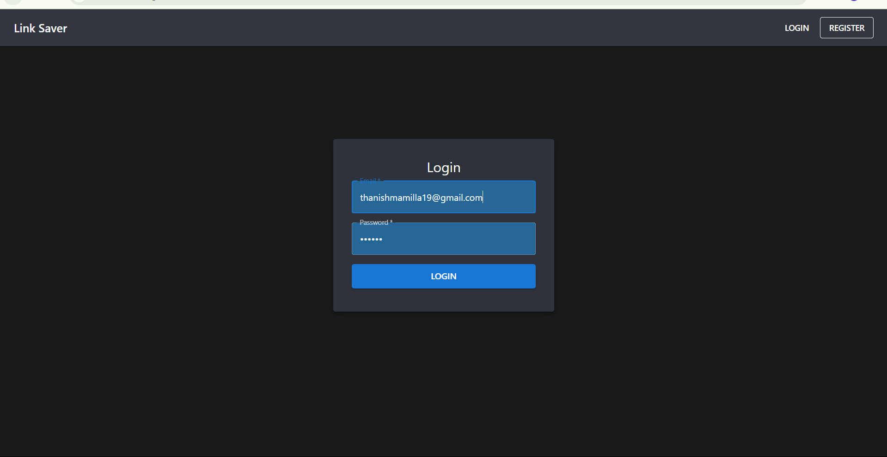
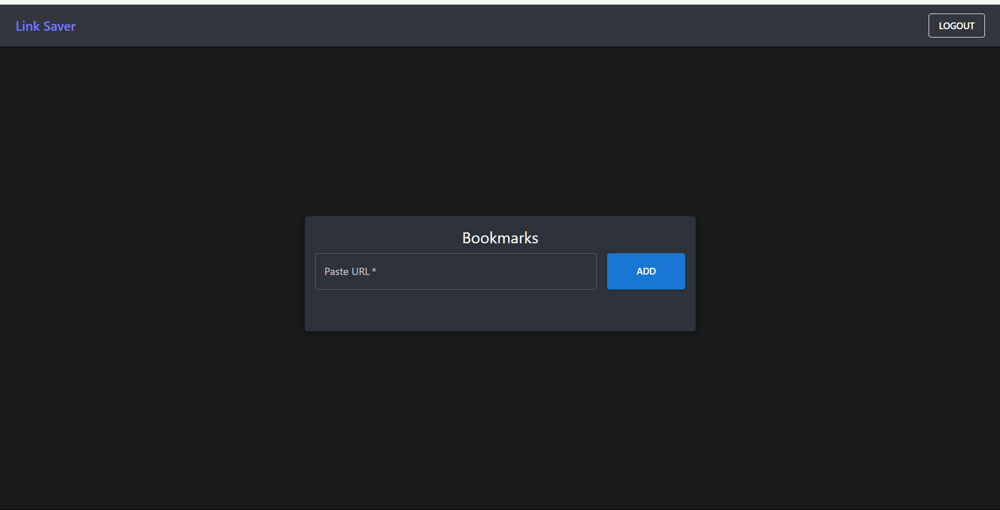
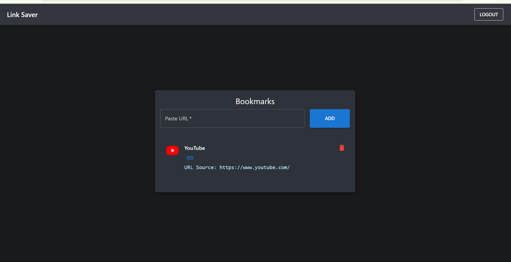

# Link Saver + Auto-Summary

A full-stack web app to save, organize, and auto-summarize your favorite links. Built with **React**, **Node.js/Express**, **MongoDB**, and **Material-UI**.

---

## ✨ Features

- **User Authentication:** Register and log in securely (JWT, bcrypt).
- **Save Bookmarks:** Paste any URL to save its title, favicon, and a smart summary.
- **Auto-Summary:** Summaries are generated using the free [Jina AI Summarisation API](https://r.jina.ai/).
- **List & View:** Responsive, modern UI to view, delete, and manage bookmarks.
- **Dark Mode:** Beautiful, accessible design with Material-UI.
- **Error Handling:** Graceful fallback if the summary API is unavailable.
- **Polished UX:** Clean, professional, and mobile-friendly.

---

## 📸 Screenshots

### Login Page


### Bookmarks (Empty State)


### Bookmarks (With YouTube Example)


---

## 🛠️ Tech Stack

- **Frontend:** React, Vite, Material-UI, Axios, React Router
- **Backend:** Node.js, Express, Mongoose, bcrypt, jsonwebtoken, dotenv
- **Database:** MongoDB (local or Atlas)
- **API:** Jina AI Summarisation (no key required)

---

## 🚀 Getting Started

### 1. Clone the repo
```sh
git clone <your-repo-url>
cd india
```

### 2. Backend Setup
```sh
cd backend
npm install
# Create a .env file (see .env.example)
npm run dev
```
**.env example:**
```
MONGODB_URI=mongodb://localhost:27017/link_saver
JWT_SECRET=your_jwt_secret_here
PORT=5000
```

### 3. Frontend Setup
```sh
cd ../frontend
npm install
npm run dev
```

### 4. Access the App
- Frontend: [http://localhost:5173](http://localhost:5173)
- Backend API: [http://localhost:5000](http://localhost:5000)

---

## 📝 How It Works

- **Register/Login:** Create an account and log in.
- **Add Bookmark:** Paste a URL, and the app fetches its title, favicon, and a concise summary.
- **View Bookmarks:** See all your saved links with summaries. Delete any you don’t want.
- **Summary API:** Uses Jina AI’s free endpoint. If the API fails, a fallback message is shown.
- **Summary Display:** Only the most relevant, readable part of the summary is shown for each link.

---

## 📦 What’s Next?

- Add tags and filtering
- Drag-and-drop reordering
- More tests and coverage
- Deploy to Vercel/Netlify (optional)

---

## 📄 License

MIT

---

## 🙏 Credits

- [Jina AI Summarisation API](https://r.jina.ai/)
- [Material-UI](https://mui.com/)

---

**Happy bookmarking!** 